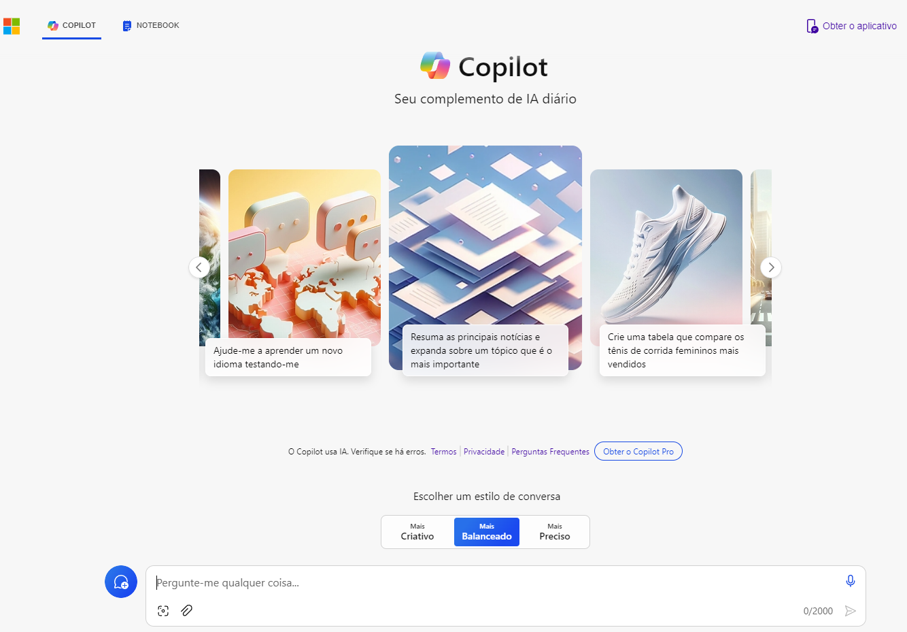
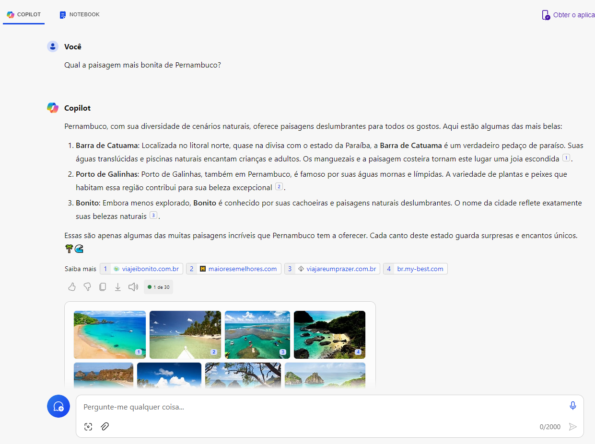
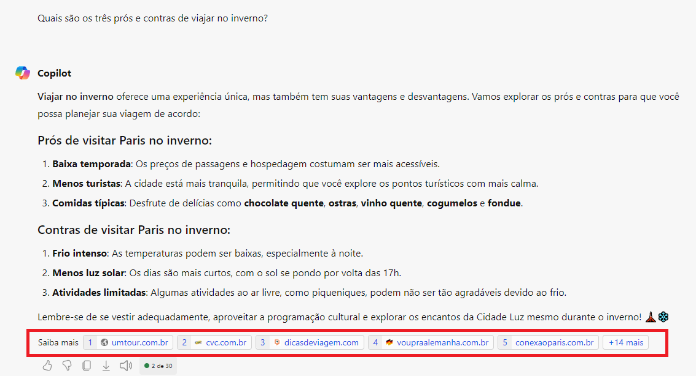
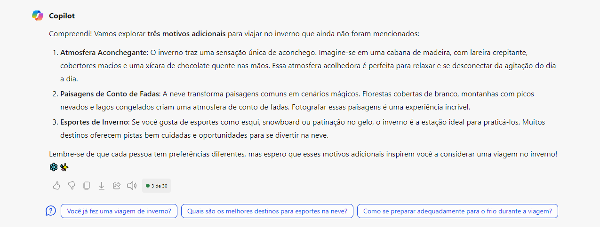
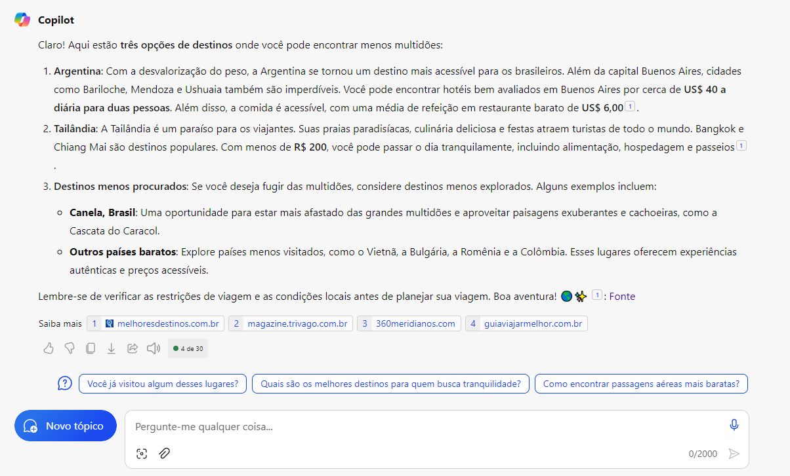
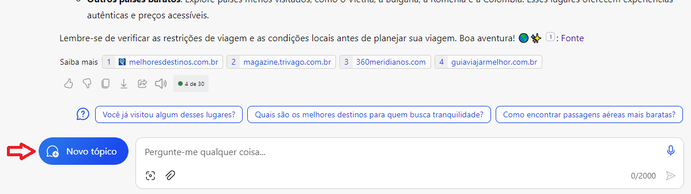
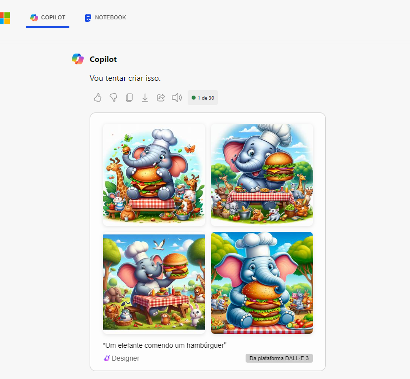
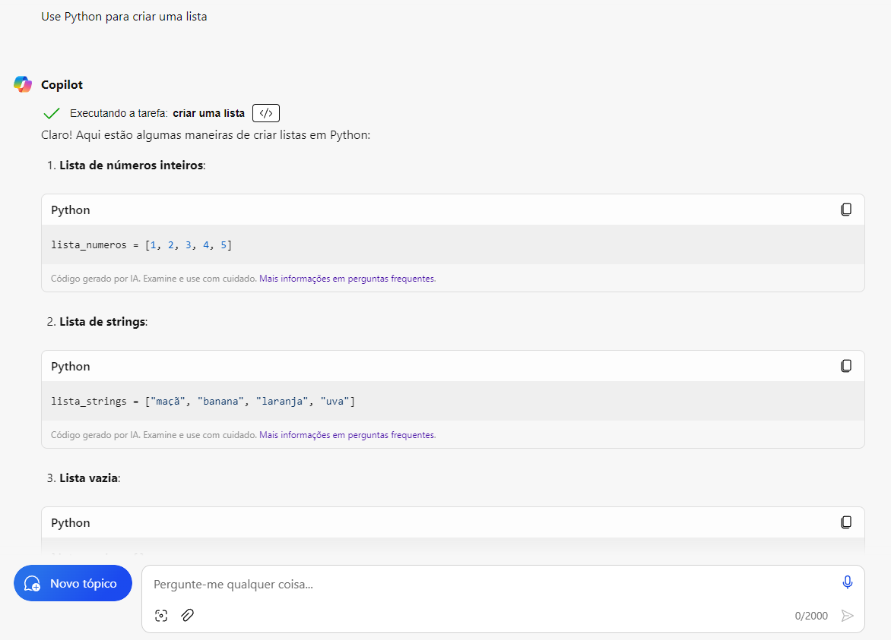
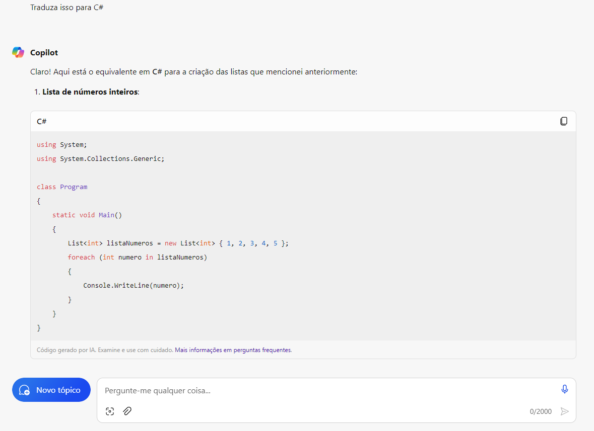
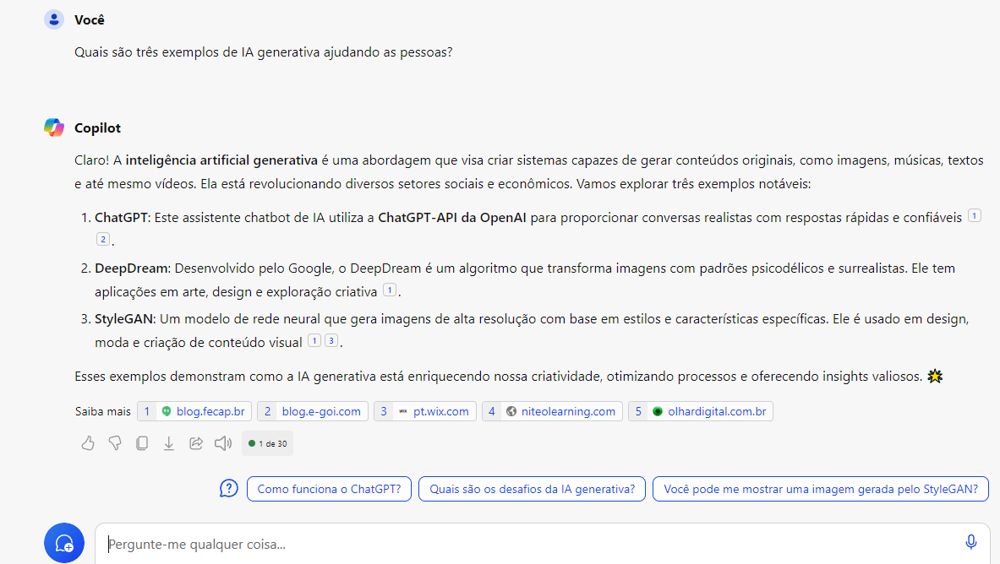

# Explorando os Recursos de IA Generativa com Copilot e OpenAI


### Explore a IA generativa com o Microsoft Copilot 

Neste exercício você explorará a IA generativa com o Microsoft Copilot.

#### Faça login no Microsoft Copilot

1. Abra o Microsoft Copilot em https://copilot.microsoft.com e entre com sua conta pessoal da Microsoft.

2. O Microsoft Copilot usa IA generativa para aprimorar os resultados de pesquisa do Bing. O que isto significa é que, diferentemente da pesquisa apenas, que retorna conteúdo existente, o Microsoft Copilot pode reunir novas respostas com base na modelagem de linguagem natural e nas informações da web.

3. Na parte inferior da tela, você verá uma janela Pergunte-me qualquer coisa. À medida que você insere prompts na janela, o Copilot usa todo o thread da conversa para retornar respostas. Por exemplo, vamos tentar fazer uma série de perguntas sobre viagens.






#### Use prompts para gerar respostas 

1. Digite um prompt: Quais são os três prós e contras de viajar no inverno? Você verá Searching for:… e Generating… aparecer antes da resposta. O modelo usa as respostas pesquisadas como informação de base para gerar respostas originais. Observe que o final da resposta contém links para suas fontes.




2. Digite um prompt: Encontre mais 3 profissionais. O que você quer dizer com esta mensagem é que gostaria de ver mais três motivos positivos para viajar no inverno que ainda não foram listados. Observe que, com esse prompt, você está pedindo ao Copilot para fazer duas coisas que a pesquisa por si só não faz: usar a resposta do chat anterior para excluir o que é retornado na nova resposta e usar o tópico do chat anterior sem declará-lo explicitamente.



3. Digite um prompt: Quais são os três lugares onde posso ir para encontrar menos multidões?



4. O botão Novo tópico próximo à janela de bate-papo é útil. Clicar nele limpa o tópico da conversa anterior para que as respostas do novo tópico não sejam baseadas no tópico anterior. Use o ícone Novo tópico próximo à janela de bate-papo para limpar seu histórico de mensagens.




#### Experimente a geração de imagens 

1. Agora vamos ver um exemplo de geração de imagens. Digite um prompt: Crie a imagem de um elefante comendo um hambúrguer. Observe que uma mensagem que tentarei criar que… aparece antes que o Copilot retorne uma resposta.



2. Na resposta, há um texto na parte inferior que diz “Powered by DALL-E”. DALL-E é um modelo de linguagem grande que gera imagens a partir de entrada de linguagem natural.


#### Experimente a geração de código 

1. Agora vamos ver um exemplo de geração e tradução de código. Digite um prompt: Use Python para criar uma lista.

2. Digite no prompt: Traduza isso para C#. Observe como você não precisou especificar o que é “aquilo”, como o Copilot sabe para se referir ao histórico de conversas.







```
using System;
using System.Collections.Generic;

class Program
{
    static void Main()
    {
        List<int> listaNumeros = new List<int> { 1, 2, 3, 4, 5 };
        foreach (int numero in listaNumeros)
        {
            Console.WriteLine(numero);
        }
    }
}


```

#### Tarefa bônus 

Digite um prompt: Quais são três exemplos de IA generativa ajudando as pessoas? Você pode usar isso como uma forma de debater suas próprias ideias de copiloto!





### Explore o Azure OpenAI 

O Azure OpenAI inclui filtros de conteúdo padrão para ajudar a garantir que solicitações e conclusões potencialmente prejudiciais sejam identificadas e removidas das interações com o serviço. Além disso, você pode solicitar permissão para definir filtros de conteúdo personalizados para suas necessidades específicas, a fim de garantir que as implantações de seu modelo imponham os princípios de IA responsáveis ​​apropriados para seu cenário de IA generativa. A filtragem de conteúdo é um elemento de uma abordagem eficaz para IA responsável ao trabalhar com modelos de IA generativos.

Neste exercício, você explorará o efeito dos filtros de conteúdo padrão no Azure OpenAI.

Este exercício levará aproximadamente 25 minutos.

#### Antes que você comece

Você precisará de uma assinatura do Azure aprovada para acesso ao serviço Azure OpenAI.

Para se inscrever para uma assinatura gratuita do Azure, visite https://azure.microsoft.com/free.
Para solicitar acesso ao serviço Azure OpenAI, visite https://aka.ms/oaiapply.


### Provisionar um recurso Azure OpenAI 

Antes de poder utilizar modelos Azure OpenAI, deve fornecer um recurso Azure OpenAI na sua subscrição do Azure.

1. Entre no portal do Azure .
2. Crie um recurso Azure OpenAI com as seguintes configurações:

> - Assinatura : uma assinatura do Azure que foi aprovada para acesso ao serviço Azure OpenAI.
> - Grupo de recursos : escolha um grupo de recursos existente ou crie um novo com um nome de sua preferência.
> - Região : Escolha qualquer região disponível.
> - Nome : Um nome exclusivo de sua escolha.
> - Nível de preços : Padrão S0
3. Aguarde a conclusão da implantação. Em seguida, acesse o recurso Azure OpenAI implantado no portal do Azure.

* Não foi realizado o requerimento para o Acesso para o Azure OpenAI Service, pois só tenho email pessoal.

### Conclusão

O Microsoft Copilot representa uma verdadeira revolução na forma como nos relacionamos com a tecnologia. Suas habilidades de gerar texto, imagens e código a partir da linguagem natural abrem novos horizontes tanto para programadores quanto para a comunicação em geral. Com sua inteligência artificial avançada, o Copilot não apenas simplifica a vida dos desenvolvedores, mas também democratiza o acesso à tecnologia. No entanto, como toda tecnologia emergente, é crucial lembrar que o Copilot é uma ferramenta de auxílio, não um substituto para o discernimento humano. À medida que continuamos a explorar suas possibilidades, devemos também considerar as implicações éticas e de privacidade associadas a essa jornada. O futuro é promissor, e o Microsoft Copilot representa um passo significativo nessa trajetória.

### Links

- https://microsoftlearning.github.io/mslearn-ai-fundamentals/Instructions/Labs/12-generative-ai.html

- https://microsoftlearning.github.io/mslearn-ai-fundamentals/Instructions/Labs/13-azure-openai.html

- https://microsoftlearning.github.io/mslearn-ai-fundamentals/Instructions/Labs/14-azure-openai-content-filters.html
